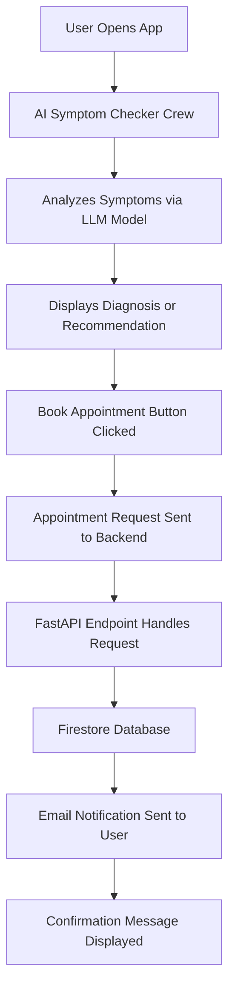
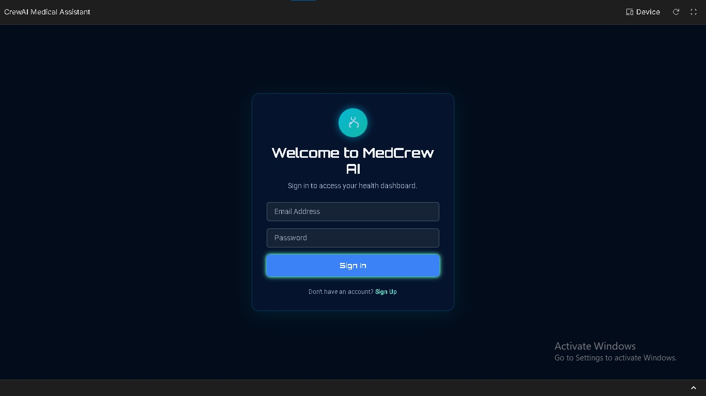
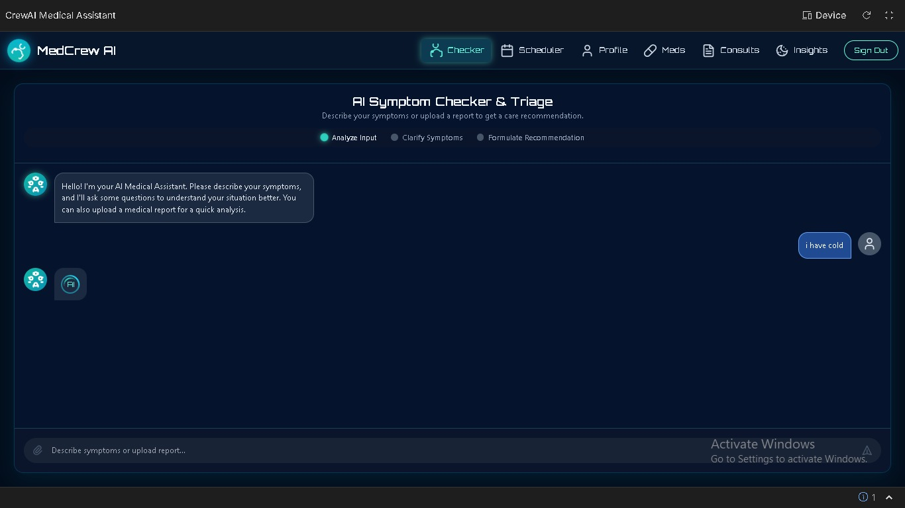
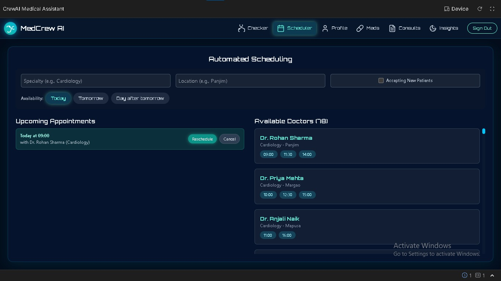
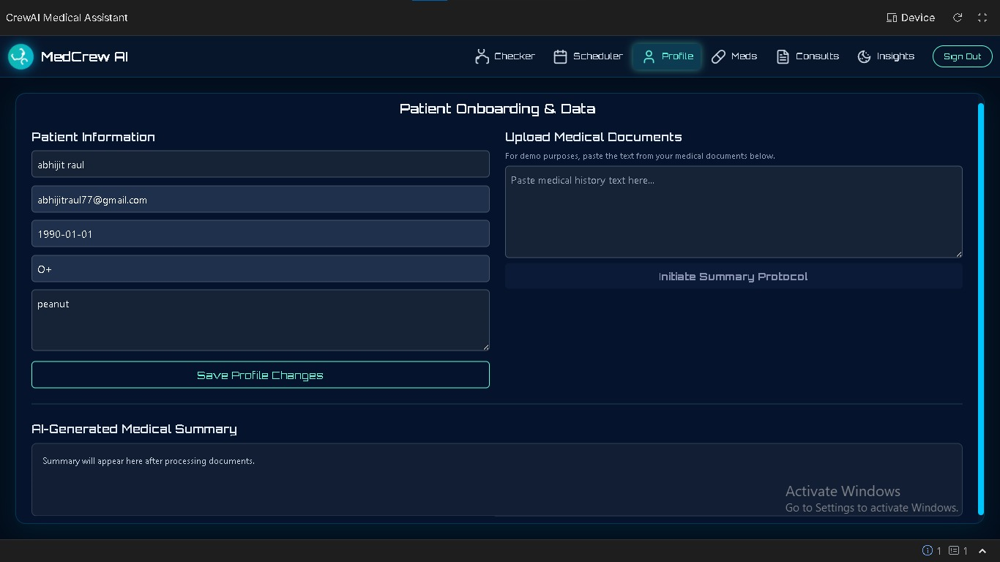
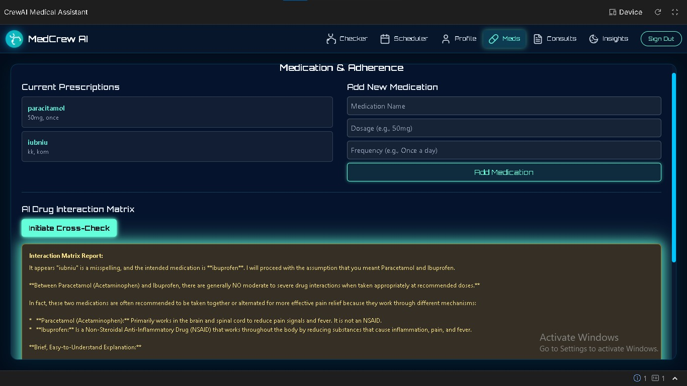

<div align="center">

</div>

# 🧠 Medical Assistant

An **Agentic AI–powered medical assistant** built with **React + TypeScript + Firebase + Gemini API**.
This project provides intelligent medical support, appointment booking, and proactive healthcare automation.

---

## 🚀 Overview

**crewAI Medical Assistant** integrates multimodal AI capabilities, cloud-based data handling, and automation for patient–doctor interactions.

It enables:

* Smart **symptom analysis** and AI triage
* **Automated appointment scheduling** with email notifications
* Real-time **patient profile management**
* **Medication tracking** and consultation history
* **Voice-based assistant** and AI insights
* Firebase authentication and persistent health records

---

## 🧩 Tech Stack

| Layer      | Technology                              |
| ---------- | --------------------------------------- |
| Frontend   | React + TypeScript + Vite               |
| Backend    | Firebase Firestore + Authentication     |
| AI Engine  | Google Gemini API                       |
| Automation | Firestore triggers, Email notifications |
| UI         | TailwindCSS + Custom React Components   |

---

## 📁 Project Structure

```
crewai-medical-assistant/
│
├── App.tsx                       # Root application file
├── firebaseConfig.ts              # Firebase initialization and config
├── types.ts                       # Global TypeScript type definitions
│
├── components/
│   ├── Auth.tsx                   # Authentication and login flow
│   ├── Scheduler.tsx              # Appointment booking & cancellation
│   ├── SymptomChecker.tsx         # AI-driven symptom analysis
│   ├── ConsultationAnalyzer.tsx   # Gemini-based consultation summarizer
│   ├── MedicationManager.tsx      # Track and manage medications
│   ├── HealthInsights.tsx         # Personalized insights & analytics
│   ├── VoiceAssistant.tsx         # Speech-to-text and interactive AI chat
│   ├── PatientProfile.tsx         # Patient health profile display
│   ├── AgentStatusPanel.tsx       # Agent system monitor & status logs
│   ├── Map.tsx                    # Locate nearby hospitals or pharmacies
│   ├── Header.tsx / DoctorAvatar.tsx
│   └── shared/                    # Reusable UI components (Card, Loader, Icons)
│
├── services/
│   ├── firebaseService.ts         # Firestore CRUD and data abstraction layer
│   └── geminiService.ts           # Handles Gemini API requests and responses
│
├── data/
│   └── doctors.ts                 # Static doctor profiles and metadata
│
├── package.json / tsconfig.json / vite.config.ts
├── index.tsx / index.html
└── .env.local                     # Environment variables (Firebase keys, API URLs)
```

---

## 🧠 Core Features

### 🩺 1. AI Symptom Checker

* Uses **Gemini API** to analyze user-reported symptoms.
* Returns likely conditions, severity levels, and recommendations.
* Helps triage cases and prepare for consultations.

### 📅 2. Appointment Scheduler

* Real-time calendar for booking, confirming, and canceling appointments.
* Integrates **email notifications** using a backend webhook.
* Synchronizes with Firebase for persistent updates.

> 🛠 If “Cancel Appointment” isn’t working, ensure `handleCancel` triggers the Firestore delete and the webhook properly returns a `200 OK` response.

### 👨‍⚕️ 3. Patient Profile Management

* Displays user-specific health data and appointment history.
* Connects directly to Firestore for read/write operations.
* Secure and isolated per authenticated user.

### 💊 4. Medication Manager

* Add, update, and delete prescribed medications.
* Tracks dosage schedules and completion rates.

### 🧬 5. Consultation Analyzer

* AI summarization of consultations using Gemini.
* Extracts actionable insights and follow-up advice.

### 🔊 6. Voice Assistant

* Uses Web Speech API for speech-to-text.
* Supports conversational queries to the AI assistant.
* Enables hands-free interaction for accessibility.

### 🧩 7. Agent Status Panel

* Displays runtime health of the AI and automation modules.
* Debug interface for developers and admins.

---

## ⚙️ Workflow



---

## 🧱 Data Flow

1. **User Action** → input via chat, form, or voice
2. **Frontend Trigger** → React component calls service
3. **Service Layer** → sends request to Firebase or Gemini
4. **Firestore Sync** → stores appointment or consultation data
5. **Automation (Webhook / Cloud Function)** → sends confirmation or reminder
6. **UI Refresh** → state updates using React hooks and Firestore listeners

---

## 🧰 Setup Instructions

### 1. Clone and Install

```bash
git clone https://github.com/yourusername/crewai-medical-assistant.git
cd crewai-medical-assistant
npm install
```

### 2. Configure Environment

Create `.env.local`:

```bash
VITE_FIREBASE_API_KEY=your_firebase_key
VITE_FIREBASE_AUTH_DOMAIN=your_domain
VITE_FIREBASE_PROJECT_ID=your_project_id
VITE_GEMINI_API_KEY=your_gemini_key
VITE_WEBHOOK_URL=https://your-server.com/webhook
```

### 3. Run the App

```bash
npm run dev
```

Visit **[http://localhost:5173](http://localhost:5173)**

---

## 🧠 Future Enhancements (Automation Goals)

* 🔁 **Automatic reminders** before appointments using Firebase Cloud Functions
* 🤖 **Agentic orchestration** with self-triggering AI workflows
* 📊 **Predictive insights** based on user health patterns
* 🧩 **RAG pipeline integration** for contextual knowledge retrieval
* 💬 **Multi-language symptom understanding**

---

## 🖼️ UI Preview


| Screen                                           | Description                  |
| ------------------------------------------------ | ---------------------------- |
|                           | Main patient dashboard       |
|           | AI-based symptom analysis    |
|                       | Appointment booking calendar |
|           | patient profile  interaction |
|                     | medication remembering       |

---

## 🧾 License

This project is licensed under the **MIT License**.

---

## 👨‍💻 Author

**Abhijit Barendra Raul**
**Rohit Daulat Koli**
M.Sc. Artificial Intelligence – Goa University
Contact: [your email here]

---
